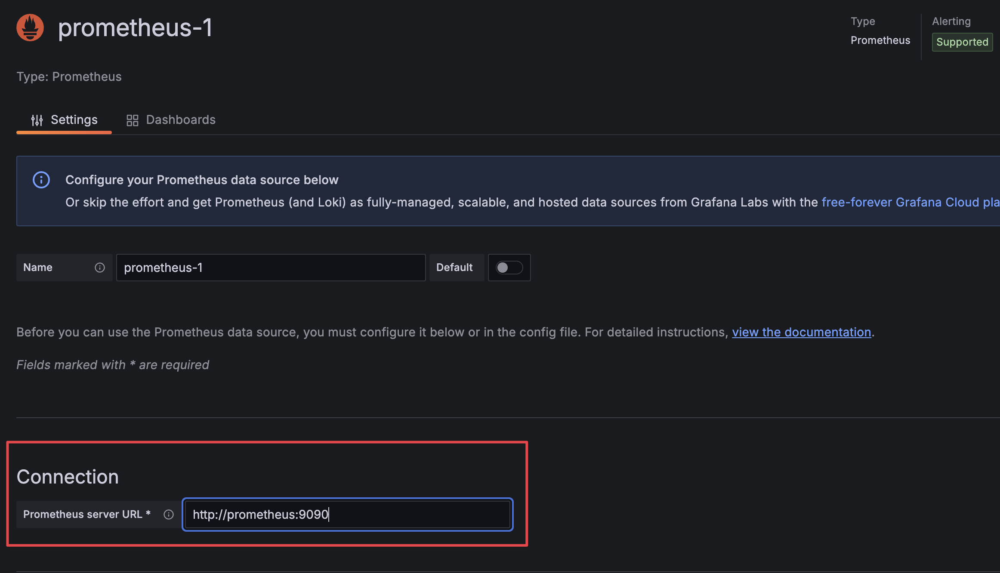

# Module 5 - Monitoring First Steps

**Goal**: Learn to configure prometheus and grafana

## Steps

The project consists of 3 components:

- metrics_app: send random statistics to log
- promotheus: provides a database to store statistics
- grafana: provides a configurable dashboards

1. Examine `docker-compose.yml` and try to identify the services
2. Examine `Dockerfile` and `metrics_app.py` discuss what these files do
3. Start the services `docker compose up --build`
4. Once started, go to `http://localhost:9090` you should be seeing the prometheus dashboard
5. Go to `http://localhost:3000` and log to grafana using the user `admin` and password `admin`
6. Select "Add your first data source"
7. Select prometheus
8. On connection, type: `http://prometheus:9090`. Note that you can access other Docker containers using the `service` defined on `docker-compose.yml`

    

9. Press **Save and test**
10. Select "Create your first dashboard"
11. Press "Add visualization"
12. Select prometheus
13. Under metric, select "request_processing_seconds_sum" (near the end of the list). This is the data the metrics_app.py application supplies.

    

14. Press **Run queries**, you should be seeing a line on the dashboards
15. Press **Save dashboard**
16. When done, press `docker compose down` to shutdown the system
